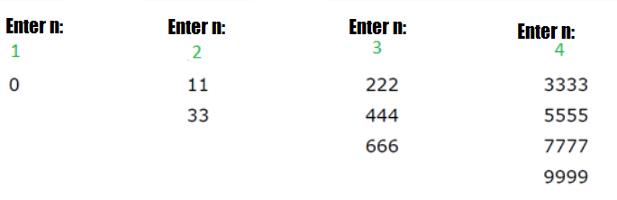
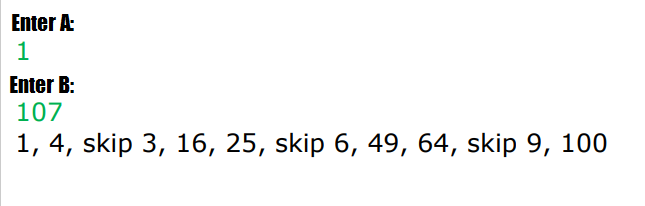

# Conditions of the tasks

### Task 01
Print all numbers from 1 to 100.

### Task 02
Print all numbers from -20 to 50.

### Task 03
Print all **odd** numbers from -10 to 10. 

### Task 04
Print all numbers from 10 to 1.

### Task 05
Ask the user to enter two numbers (A and B) from the console. Print all numbers from smaller to larger

### Task 06
Ask the user to enter a number from the console. Then print the sum of all numbers between 1 and the entered number.

### Task 07
Ask the user to enter a number (N) from the console. Then starting from 3, print on the screen first N numbers which 
are divided into 3. The printed numbers should be separated by а comma (,)

### Task 08
Ask the user to enter a number from the console. Then based on the entered number, print the following table on the 
screen:

### Task 09
Ask the user to enter two numbers from the console (A and B). Print all numbers from A to B raised to the power of 2 
(separated by a comma). Print **skip 3** if any of the number is not divisible by 3. When the sum of all printed numbers 
(without the skipped ones) is greater than 200, stop the program.

### Task 10
Ask the user to enter a number from the console. Print whether number is prime or not. 
**Note:** Prime number is that which is divisible only by 1 and by itself.