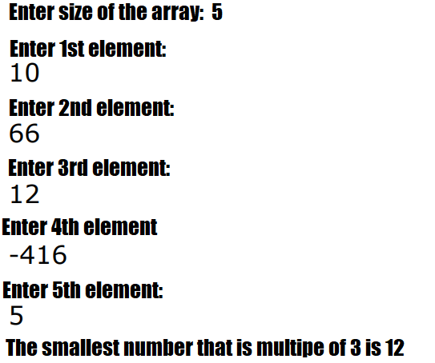
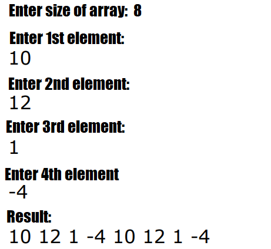
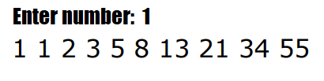

# Conditions of the tasks

## Task with classes, methods and fields

Create class Computer which represents a computer. 
The class contains the following fields:  
* *year* - numerical value representing the manufactured year of computer
* *price* - numerical value representing the price of the computer
* *isNotebook* - boolean value - whether the computer is laptop (isNotebook = true) or desktop (isNotebook = false)
* *hardDiskMemory* - numerical value for the size of the hard disk
* *freeMemory* - numerical value representing free memory
* *operationSystem* - text field about operating system of the computer

The class contains the following methods:  
* method `void useMemory(double memory)` that decrease the free memory with value that is entered from the user as 
  an argument. If the value of the argument is grater than the free memory then print the following message: `"Not 
  enough free memory!"`
* method `void changeOperationSystem(String newOperationSystem)` that change the value of the `operationSystem` 
  field with the value entered by the user as argument.
  
Create class ComputerDemo with `main` method.   Within the main method create 2 Computer objects  
Set values for each field - `year`, `price`, `hardDiskMemory`, `freeMemory`, `operationSystem`.  
Let one of the created computers to be a laptop. Using `useMemory` method, allocate 100 memory for one of the 
computers and for the other computer change the operating system using `changeOperationSystem` method.  
After that print all fields of both computers.

## Array Tasks

### Task 01
Ask the user to enter a number from the console and then create an array with size equal to the entered number.
Fill in the array with elements and then find the smallest number that is multiple of 3.
If there is no such number in the array, print appropriate message. 

### Task 02
Ask the user to enter a number from the console that is multiple of 2. Then create an array with size equal to the 
entered number. Using appropriate messages ask the user to enter half of the elements of created array.
Other elements in the array (the empty ones) should be equal to the first half of the array.
Print the array. 

### Task 03
Ask the user to enter a number from the console and then create an array with 10 elements according to the following 
rules: 
- first two elements of the array are equal to the entered number from the console  
- each subsequent element of the array is equal to the sum of previous two elements in the array  
After that print the array in the console.  

  
### Task 04
Ask the user to enter a number from the console and then create an array with size equal to the entered number.
Using appropriate messages (as in **Task 02**) ask the user to enter elements of the array. 
Then verify whether the array is mirrored or not. 
- Following arrays are mirrored:  
  `[3,7,7,3]`  
  `[4]`   
  `[1 55 1]`   
  `[6 27 -1 5 7 7 5 -1 27 6]`  
  
### Task 05
Write a program which creates an array with 10 element (type double) and initialize each element of the array to be 
equal to element's index multiplied by 3. Then print the created array.
  